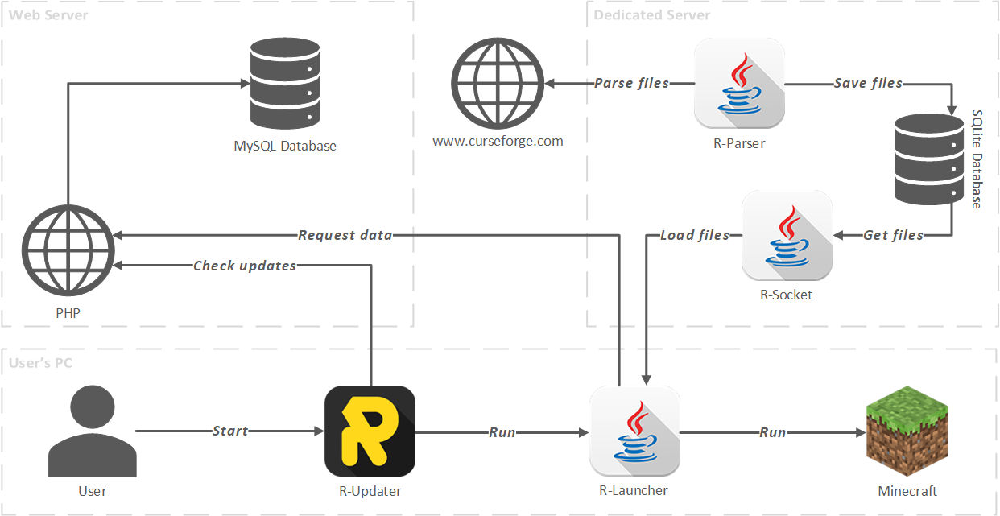
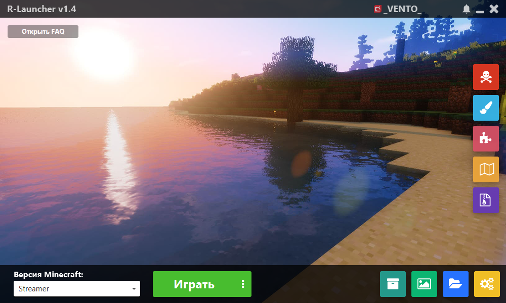
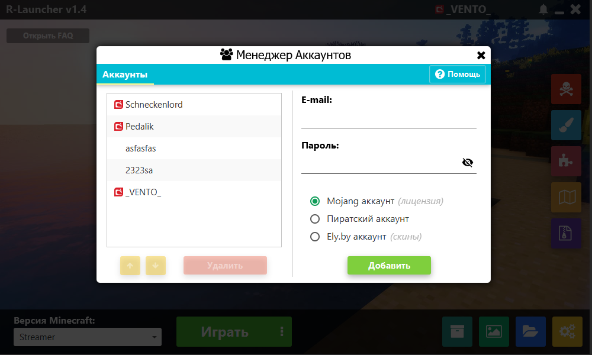
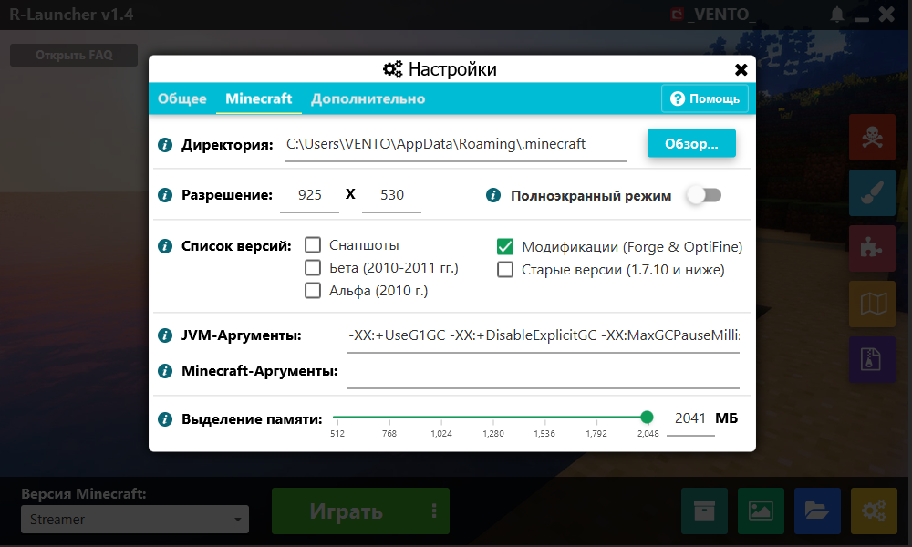
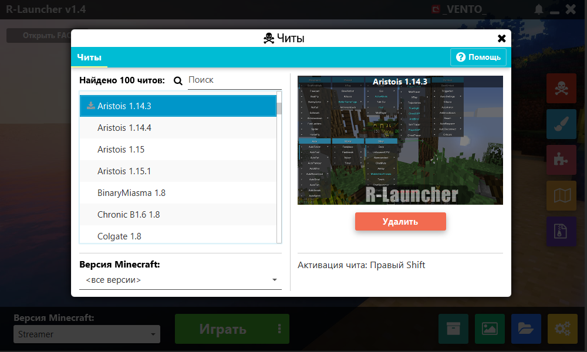
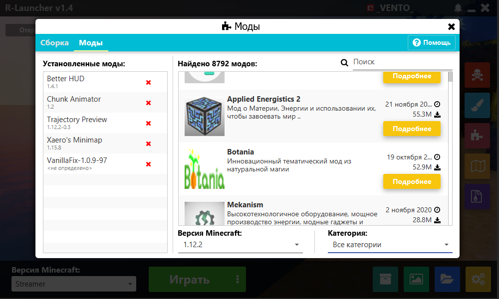
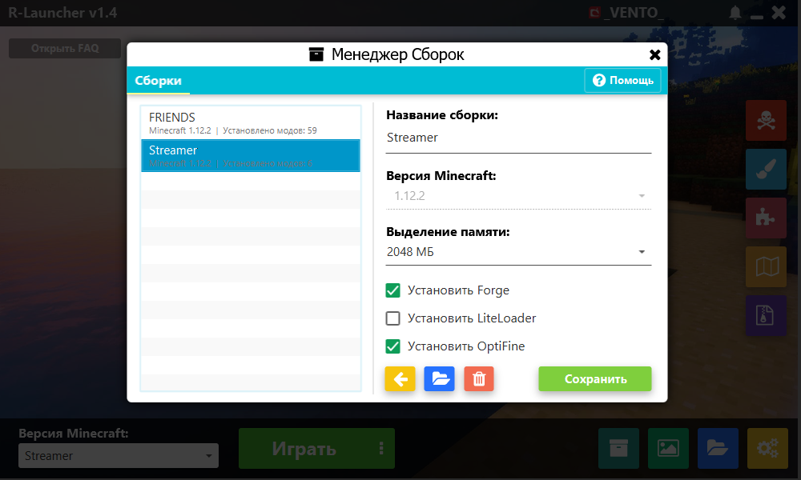

# R-Launcher
R-Launcher is custom Minecraft launcher that has a lot of useful features for comfortable gaming.

## Features
The main features of R-Launcher:
- built-in installer that can install launcher and JVM on first run
- supports all Minecraft versions
- modern and beautiful design with animations
- customizing background image
- advertising Minecraft servers
- supports 3 types of accounts: free, Mojang, Ely.by
- notifications
- debug console for Minecraft
- analyzer of Minecraft errors
- availability to install cheats just in one click
- availability to install resource packs just in one click
- availability to install modifications just in one click
- availability to install maps just in one click
- availability to install modpacks just in one click
- creating own modpacks

## Technologies
- Java 8
- JavaFX

## Architecture

The architecture of R-Launcher includes 5 modules:
- R-Updater: an application that installs launcher, checks for updates and runs a launcher
- R-Launcher: an application that can download Minecraft files, assets, cheats, resource packs, mods and runs a game
- R-Launcher Web: PHP scripts that are located on a web server, accept requests from launcher and send back necessary data
- R-Parser: a server application that parses resource packs, mods, maps and modpacks from curseforge.com
- R-Socket: a server application that returns a direct link for downloading requested file from curseforge.com

## Screenshots

## License
The launcher is licensed under the GNU General Public License v3.0.
